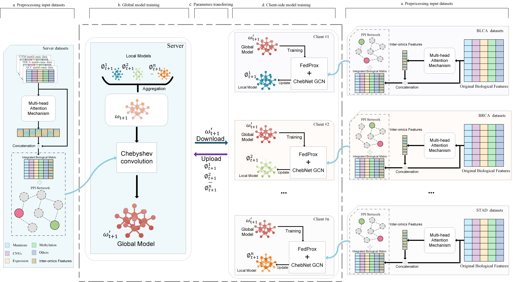

# FTDL-SCdriver
FTDL-SCdriver is a model based on federated tranferring learning and graph convolution, used to identify cancer driver genes. It can identify not only common genes but also unique genes.

## Requirements
The project is written in Python 3.7, and all experiments were conducted on a Windows server with an Intel 13th Gen Core i7-13700KF (3.44GHz, 64G RAM) and Nvidia RTX 4080s GPU (16G GPU RAM). For a faster training process, training on a GPU is necessary, but a standard computer without a GPU also works (though it will consume much more training time). We recommend the following hardware configuration:  
* CPU >= 16G
* GPU >= 12G  

All implementations of FTDL-SCdriver and the GNN-based baselines were based on PyTorch and PyTorch Geometric. FTDL-SCdriver requires the following dependencies:
* python == 3.7.16
* numpy == 1.21.5
* scikit-learn == 1.0.2
* pytorch == 1.12.1
* torch-geometric == 2.3.1
* torch-cluster == 1.6.0
* torch-scatter == 2.1.0
* torch-sparse == 0.6.16  

## Input Data
The input data for each cancer type is stored in the data/cancer_type/raw folder, including multi-omics features of genes, Inter-omics features, labels, and the adjacency matrix of the graph. 
Running the main.py script will automatically generate the corresponding PyG file format.

## Run FTDL-SCdriver

To obtain internal correlated features, please execute the following command:

```bash
python Extract_internal_association_features.py
```
If you want to run the FTDL-SCdriver model, please execute the following command:
```bash
python main.py
```

## Optimize with optuna hyperparameters
First, install the Optuna package
```bash
pip install optuna == 3.6.1
```
Then navigate to the Optuna folder and execute the following command:
```bash
python optuna_train.py
```

## Output
The model's output results are stored in the results folder.
The gene_score file contains the results predicted by both the local and global models for each cancer type. 
The hyperparameters.csv file records the combinations of 100 different results from the Optuna hyperparameter optimizer.


